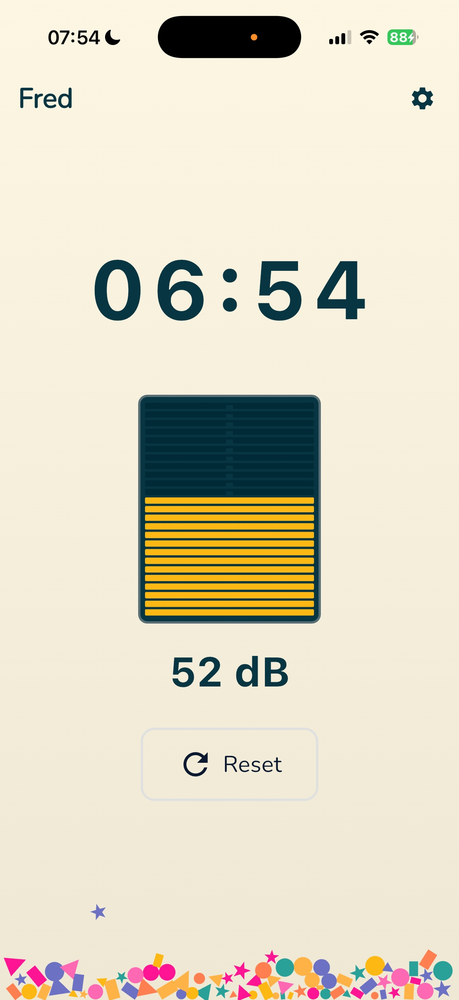
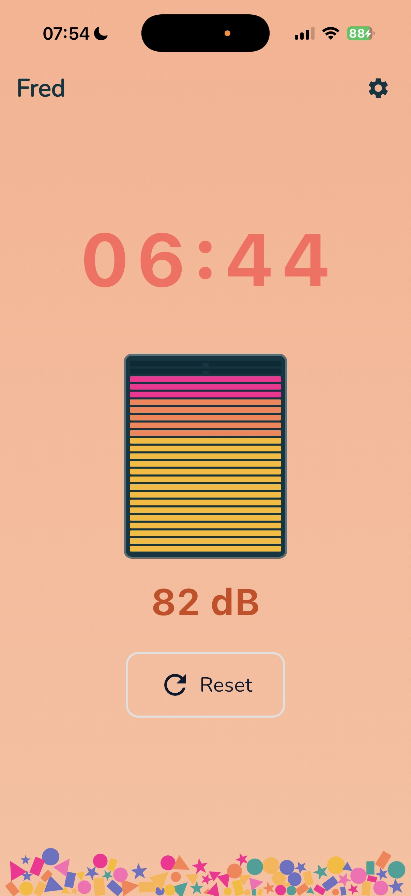
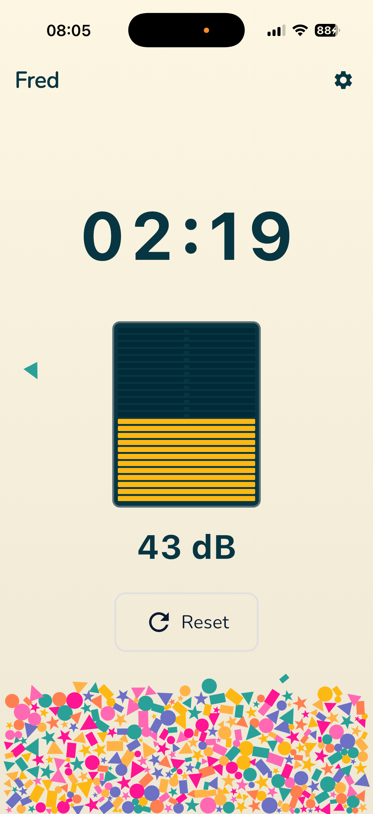
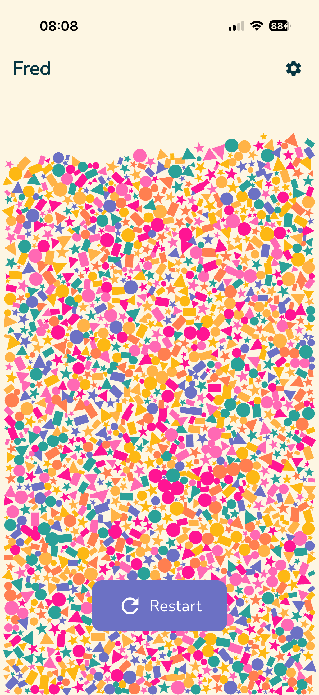

# Fred

A timer that rewards silence. Fred monitors ambient noise levels — if it gets too loud, the timer resets. Stay quiet until it reaches zero and enjoy a confetti celebration.

*Fred means peace in Norwegian.*

## Screenshots

<p align="center">
  
  
  
  
</p>

## How It Works

1. Set your desired duration and noise threshold
2. Press **Start** to begin the countdown
3. Enjoy the quiet — confetti gently falls as the timer progresses
4. The meter and background change color as noise increases (yellow > coral > fuchsia)
5. If noise stays above the threshold, the timer resets
6. Reach zero and the screen fills with a confetti celebration!

## Features

- **Real-time noise monitoring** via device microphone
- **Configurable timer** (1-60 minutes, default 10)
- **Adjustable thresholds** for warning and reset levels
- **Visual feedback** - alsamixer-style meter with color-coded blocks, background blinks
- **Haptic feedback** - pulsing vibration warnings, heavy burst on reset
- **Physics-based confetti** that builds up gradually and explodes on completion
- **Privacy-first** - all audio processing happens on-device, nothing is recorded or transmitted

## Settings

- Timer duration (1-60 minutes)
- Noise threshold (40-100 dB)
- Warning threshold (30 dB to threshold - 5 dB)
- Decibel reference guide for common sounds

## Running

```bash
flutter run
```

## Tech Stack

- Flutter/Dart
- `noise_meter` - real-time decibel monitoring
- `forge2d` - physics engine for confetti
- `google_fonts` - Nunito typeface
- `vibration` - haptic feedback
- `shared_preferences` - settings persistence
- `wakelock_plus` - keeps screen on during timer

## Privacy

Fred collects no personal data. Microphone audio is processed in real-time on your device only — nothing is recorded, saved, or transmitted. See [Privacy Policy](PRIVACY_POLICY.md).
